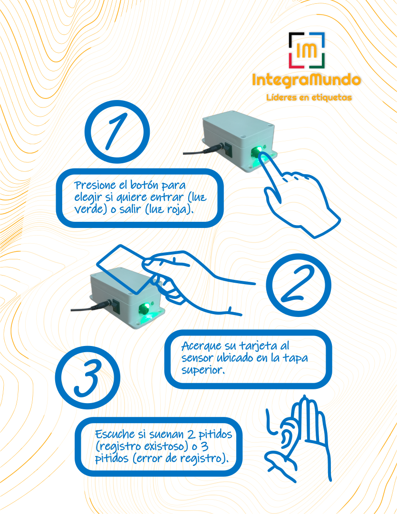

# Control de Asistencia con Nodemcu ESP8266

Sistema de control de asistencia empresarial desarrollado con un
microcontrolador nodemcu esp8266 y el módulo RFID RC522.

## Compilación

Para compilar el proyecto es necesario configurar PlatformIO IDE:

https://platformio.org/

La mejor opción es instalarlo como una extensión de VSCode.

## Flash

Una vez configurado el proyecto solo hace falta ejecutar los comandos
`build` y `upload`.

## Cableado

Puedes seguir esta guía para cablear el RC522 al nodemcu:

https://www.aranacorp.com/es/uso-de-un-modulo-rfid-con-un-esp8266/

Los únicos pines que he cambiado son el SDA y el RST que estan
configurados en el código fuente junto a un buzzer activo, un botón y
dos leds que puedes cablear a tu gusto.

## Funcionamiento

Diseñé el sistema para conectar el nodemcu con un servidor python
flask:

https://github.com/alepaillas/flask-asistencia-odoo

Este servidor es el encargado de mapear las tarjetas configuradas a
los nombres de los empleados y finalmente registrar sus asistencias en
Odoo. Pero este código es independiente de la lógica que necesites
para registrar tus asistencias. Lo importante es enviar los requests
al backend mediante la API que implementes.

## Instrucciones

1. Para utilizar el control de asistencia es necesario conectar a la
corriente el módulo ilustrado con una fuente de poder de 9V 1A.
2. Enseguida presione el botón de encendido de modo que la posición
indicada por el símbolo “|” este hacia abajo (“O” indica circuito
abierto y “|” flujo de corriente).  3. Las luces parpadearán por unos
momentos. Espere hasta que se encienda la luz verde para utilizar el
control de asistencia.  4. El dispositivo cuenta con 2 modos de
operación indicados por una luz verde y una luz roja. La luz verde
indica que el módulo está en modo “ingreso”. La luz roja indica que el
módulo está en modo “salida”. Para cambiar de modo de operación
presione el botón circular negro ubicado junto a las luces.  5. Una
vez elegido si quiere registrar su entrada o salida, acerque su
tarjeta al sensor ubicado en la parte superior del módulo.  6. Puede
corroborar que su registro ha sido exitoso porque el módulo emitirá 1
pitido al momento de acercar su tarjeta y luego de unos segundos
emitirá 2 pitidos seguidos. Si no se ha podido registrar su asistencia
se emitirán 3 pitidos seguidos.

| Código de sonido | Significado |
|---|---|
| 1 pitido corto | Tarjeta leída correctamente. |
| 2 pitidos cortos | Asistencia registrada correctamente. |
| 3 pitidos cortos | No se pudo registrar su asistencia. Compruebe si la red Wifi está funcionando, si el servidor está recibiendo peticiones y si su usuario esta autorizado. |
| 3 pitidos largos | Si el dispositivo está en modo de ingreso: Ya hay un ingreso registrado, para registrar una nueva asistencia primero registre su salida. En modo de salida: Ya hay un registro de salida activo, primero registre su entrada antes de registrar su salida. |
| 4 pitidos rápidos | La tarjeta no esta registrada en el sistema. |

